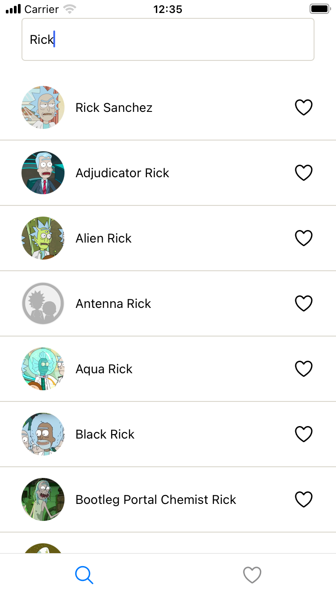

<p align="center">
  <a href="#rocket-tecnologias">Tecnologias</a>&nbsp;&nbsp;&nbsp;|&nbsp;&nbsp;&nbsp;
 <a href="#art-layout">Como usar</a>&nbsp;&nbsp;&nbsp;
</p>

## :rocket: Tecnologias

Este projeto foi desenvolvido com as seguintes tecnologias:

- [Typescript](https://www.typescriptlang.org/)
- [Expo](https://docs.expo.dev/)
- [Expo Router](https://docs.expo.dev/router/introduction/)
- [React Query](https://tanstack.com/query/)
- [Axios](https://github.com/axios/axios)

---

## :art: Layout

 <div style="display: flex; margin-bottom: 32px; gap: 20px">
     
     
     
 </div>

---
## :information_source: Como usar

Você deve ter os seguintes programas instalados em seu sistema operacional. [Git](https://git-scm.com) | [Node.js](https://nodejs.org/en/) |  [Yarn](https://yarnpkg.com/)  | [Expo](https://expo.dev/)


```bash

# Clone o repositório
$ git clone https://github.com/yucorrea/hubapp

# Navegue até a pasta do projeto
$ cd hubapp

# Instale as dependências
$ yarn install or npm install

 \{^_^}/ hi!
```

Desenvolvido por: Yuri Corrêa :wave: [Entrar em contato!](https://www.linkedin.com/in/yucorrea/)